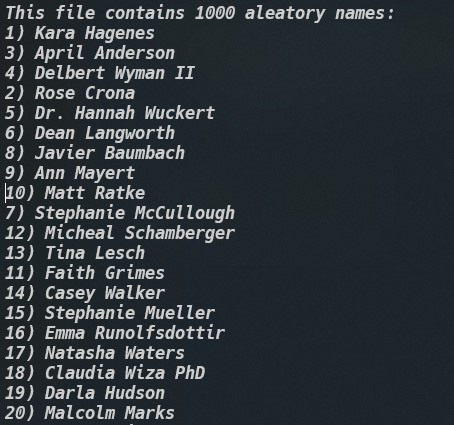

# Introduction
This exercise creates 1000 aleatory names using the [<code>faker</code>](https://www.npmjs.com/package/@faker-js/faker) package.

The 1000 names are writing in the 1000Names.txt file.

Some code part, to generate the 1000 names, is:

```js
for (let i = 0; i < namesMax; i++) {
    let randomName = faker.name.findName(); // Rowan Nikolaus
    fs.appendFile("1000Names.txt",`${i}) ${randomName}\n`,err => {
        if (err) {
            console.log(err)
        }
    });
}
```

The result is shown in the following figure:



However, the number sequence is shown in disorder. 
**This issue needs to be fixed.**